# HANSAFLEX E-commerce Platform - UI Guide & User Flow

This document provides a visual guide to the HANSAFLEX E-commerce Platform, showcasing the user interface and explaining the application flow for both administrators and customers.

## 📱 Application Overview

The HANSAFLEX E-commerce Platform consists of two main user interfaces:
- **Customer Dashboard**: For browsing products, managing cart, and placing orders
- **Admin Dashboard**: For product management, order tracking, and system configuration

## 🎯 User Roles & Access

### 👤 Customer Role
- Browse product catalog
- Add items to shopping cart
- Place orders
- View order history
- Manage wishlist

### 👨‍💼 Admin Role
- Manage products (CRUD operations)
- Track and manage orders
- Configure VAT rules by region
- Manage customer accounts
- Monitor system performance

## 🚀 Application Flow

### 1. Landing Page & Authentication

#### Home Page

*Welcome page showcasing the HANSAFLEX brand and product categories*

#### Login Page

*Secure login interface with username and password authentication*

#### Signup Page

*User registration form with role selection and regional preferences*

### 2. Customer Dashboard Flow

#### Customer Dashboard Overview
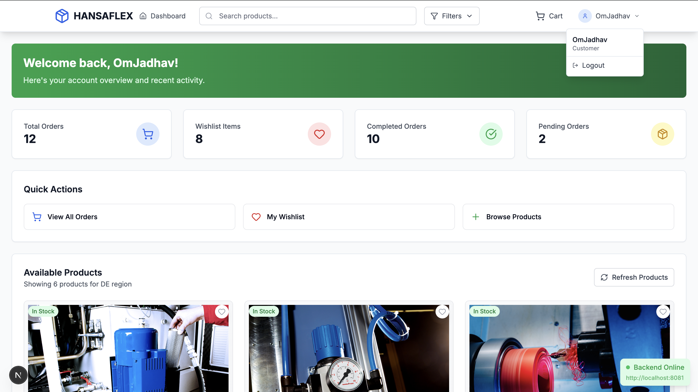
*Main customer interface showing product catalog with filtering options*

#### Product Details
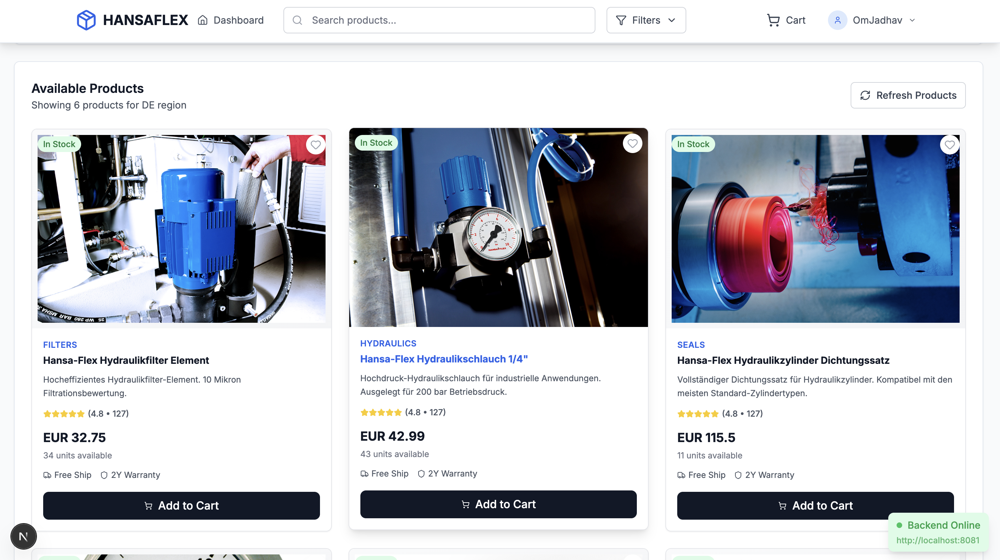
*Detailed product view with specifications, pricing, and add to cart functionality*

#### Shopping Cart
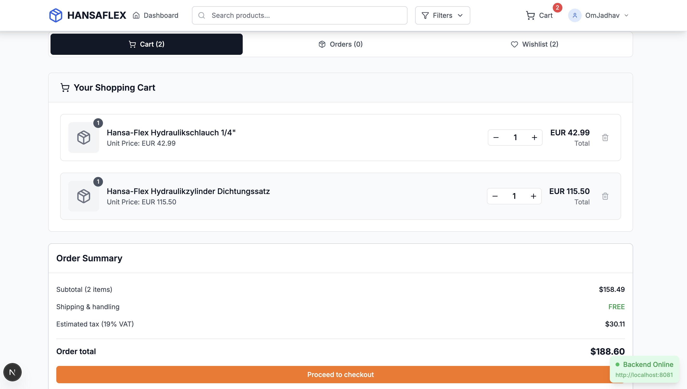
*Cart management interface with quantity controls and checkout options*

#### Checkout Process
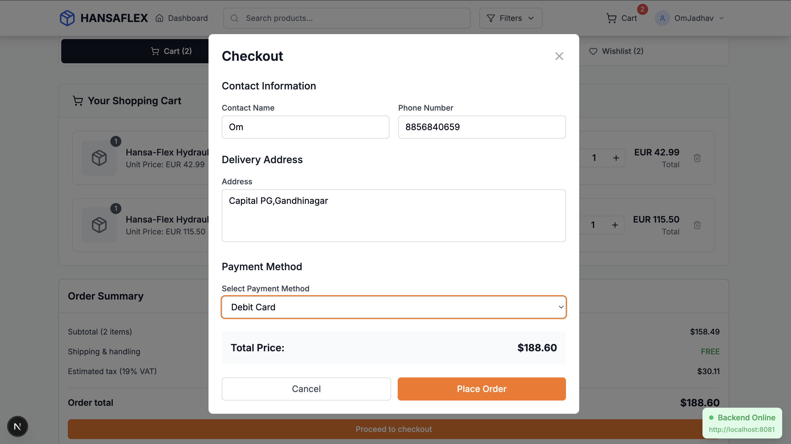
*Order placement form with customer details and payment information*

#### Customer Order Details
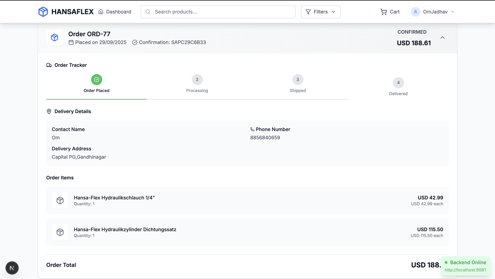
*Order history and tracking interface for customers*

#### Wishlist
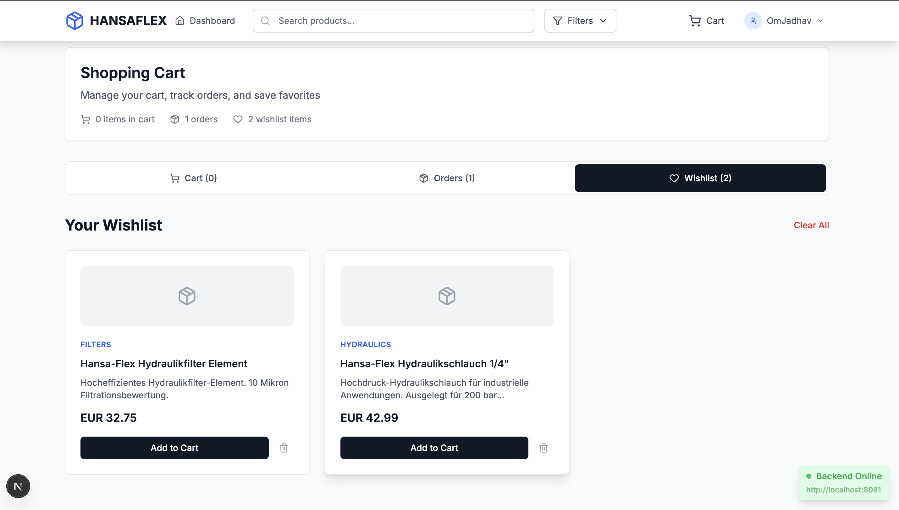
*Customer wishlist for saving favorite products*

### 3. Admin Dashboard Flow

#### Admin Dashboard Overview
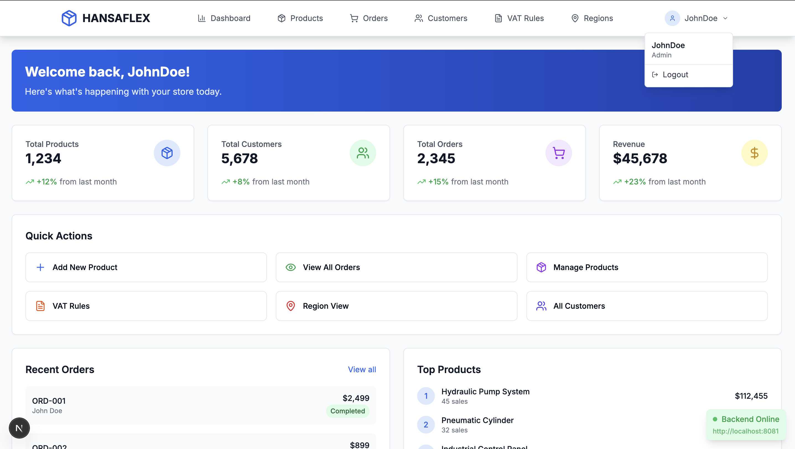
*Administrative interface with system overview and quick actions*

#### Product Management
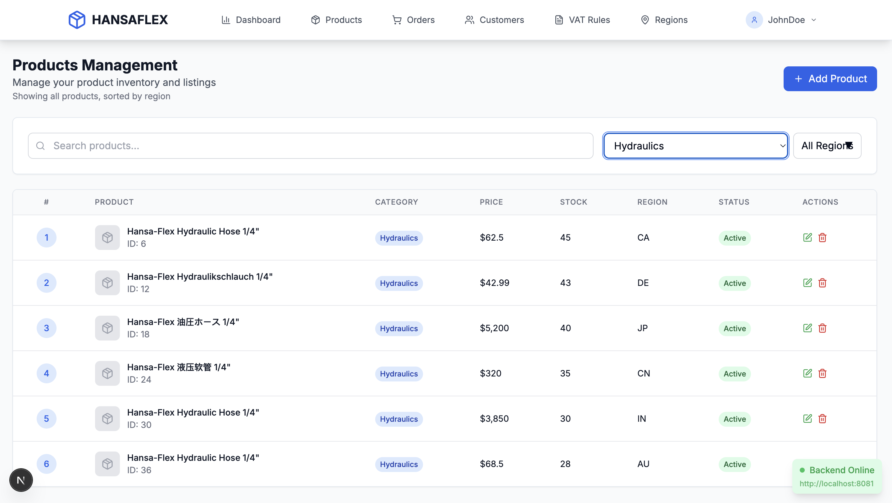
*Product management interface with CRUD operations and product listing*

#### Create Product Form
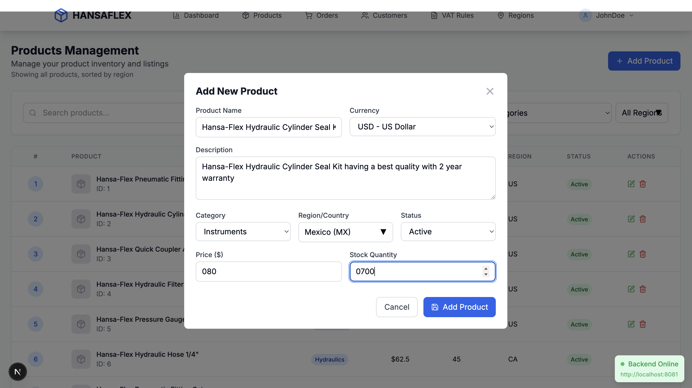
*Product creation form with all required fields and validation*

#### Edit Product Form
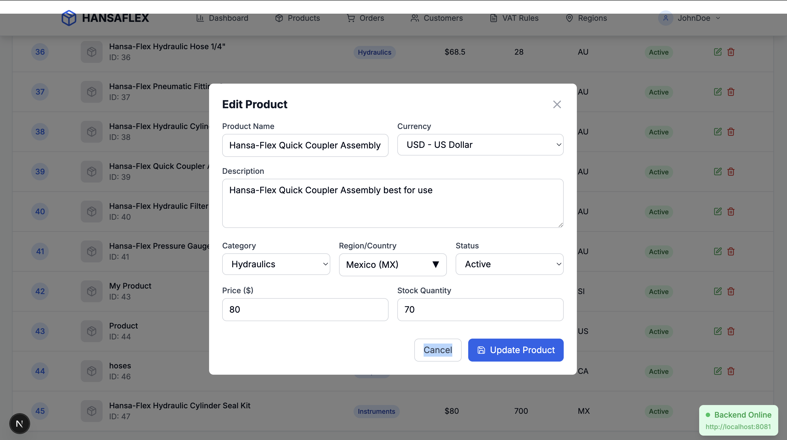
*Product editing interface for updating existing products*

#### VAT Rule Management
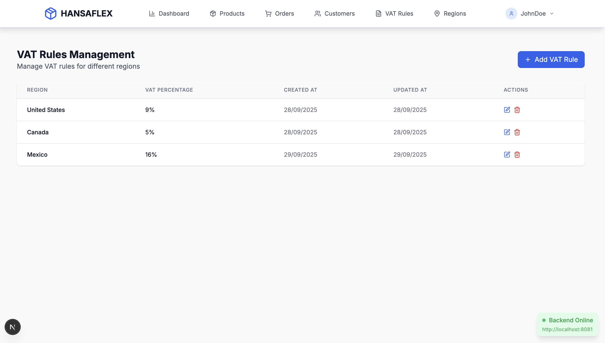
*Regional VAT rate configuration and management interface*

#### Create VAT Rule Form
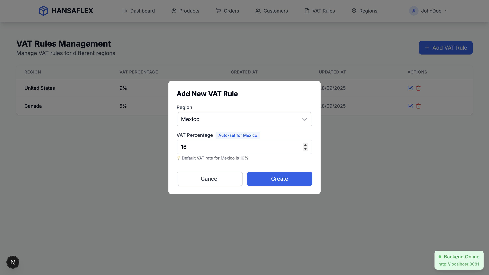
*Form for creating new regional VAT rules*

#### Customer Invoice
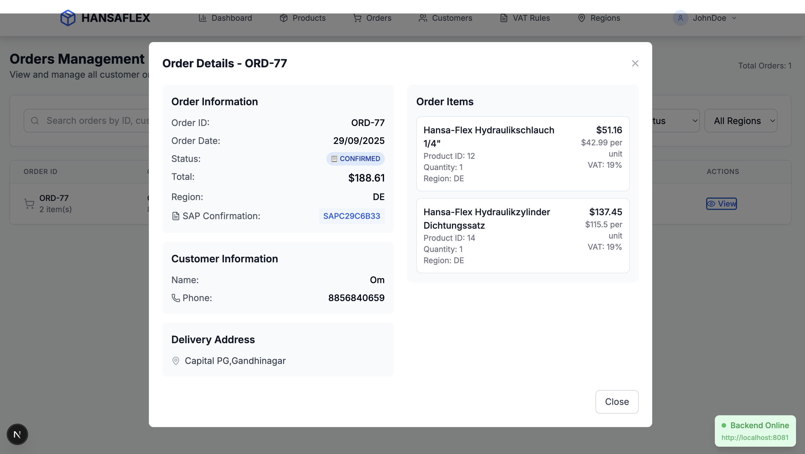
*Invoice generation and customer billing management*

## 🎯 Key UI Features

### 1. Smart Product Images
- **Automatic Image Assignment**: Products automatically get relevant images based on category
- **Fallback System**: Default images for products without specific images
- **Hover Effects**: Smooth image transitions and scaling effects

### 2. Real-time Stock Management
- **Stock Indicators**: Visual indicators for stock levels (In Stock, Low Stock, Out of Stock)
- **Automatic Updates**: Stock quantities update in real-time after orders
- **Inventory Alerts**: Low stock warnings for administrators

### 3. Advanced Filtering & Search
- **Category Filters**: Filter products by category (Hydraulics, Pneumatics, etc.)
- **Price Range**: Filter by price range
- **Region Filters**: Filter products by region (US, EU, APAC)
- **Search Functionality**: Text-based product search

### 4. Multi-Regional Support
- **Regional Pricing**: Different prices and VAT rates by region
- **Currency Display**: Automatic currency formatting based on region
- **Regional Products**: Products specific to certain regions

### 5. Order Management
- **Order Tracking**: Real-time order status updates
- **Bulk Orders**: Support for multiple item orders
- **Order History**: Complete order history for customers
- **Confirmation Numbers**: Unique order confirmation numbers

### 6. Invoice Management
- **Invoice Generation**: Automated invoice creation for orders
- **Customer Billing**: Comprehensive billing management
- **Payment Tracking**: Track payment status and history

## 📱 Responsive Design

### Desktop View (1200px+)
*Full-featured desktop interface with sidebar navigation and detailed product grids*

### Tablet View (768px - 1199px)
*Optimized tablet interface with collapsible navigation and adjusted grid layouts*

### Mobile View (320px - 767px)
*Mobile-optimized interface with hamburger menu and single-column layouts*

## 🎨 Design System

### Color Palette
- **Primary**: Blue (#3B82F6) - Trust and professionalism
- **Secondary**: Gray (#6B7280) - Neutral and clean
- **Success**: Green (#10B981) - Success states and stock indicators
- **Warning**: Orange (#F59E0B) - Low stock and warnings
- **Error**: Red (#EF4444) - Errors and out of stock
- **Background**: White (#FFFFFF) - Clean and minimal

### Typography
- **Headings**: Inter font family for modern appearance
- **Body Text**: System fonts for optimal readability
- **Code**: Monaco font for technical content

### Spacing & Layout
- **Grid System**: 12-column responsive grid
- **Spacing Scale**: 4px base unit (4px, 8px, 12px, 16px, 24px, 32px, 48px, 64px)
- **Border Radius**: 8px for cards, 4px for buttons and inputs

## 🔧 Interactive Elements

### Buttons
*Various button states: default, hover, active, disabled*

### Form Elements
*Input fields, dropdowns, and validation states*

### Loading States
*Loading indicators and skeleton screens*

### Error Handling
*Error messages and empty states*

## 📊 Data Visualization

### Dashboard Analytics
*Admin dashboard with sales analytics and performance metrics*

### Order Status Tracking
*Visual order status progression from placement to completion*

For technical documentation, please refer to the main [README.md](./README.md) file.